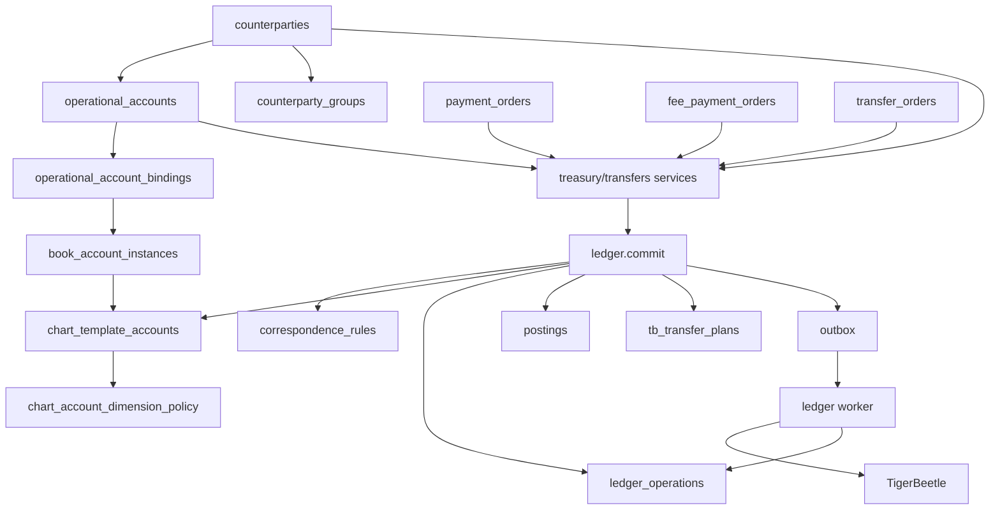

# Bedrock Monorepo Architecture

Last updated: 2026-02-26

## Source of truth

This document reflects the current implementation in the repository.
The accounting model in this doc is treated as the canonical architecture:

1. `Counterparty`
2. `OperationalAccount` (single-currency external endpoint)
3. `BookAccountInstance` (book org + account no + currency + dimensions hash)
4. `LedgerOperation` / `Posting` (operation header + postings)

## Core accounting model

### 1) Counterparty

`counterparties` represents legal entities and operational subjects (bank, exchange, custodian, intragroup entity).

### 2) OperationalAccount (OA)

`operational_accounts` is an external money endpoint bound to one counterparty and one currency:

- `counterparty_id`
- `currency_id`
- provider/type via `account_provider_id`
- external attributes (`iban`, `account_no`, `address`, `corr_account`, etc.)
- `stable_key` for deterministic identity per counterparty

### 3) BookAccountInstance

`book_account_instances` is the internal ledger location for postings:

- `book_org_id` (book org)
- `account_no` (CoA account)
- `currency`
- `dimensions` + `dimensions_hash`
- deterministic TigerBeetle mapping (`tb_ledger`, `tb_account_id`)

### 4) LedgerOperation and Postings

Financial facts are persisted as:

- `ledger_operations`: operation metadata, idempotency, payload hash, posting status
- `postings`: debit/credit posting rows with analytics
- `tb_transfer_plans`: TB execution plan rows
- `outbox`: async posting queue

## Relationship model

### OA -> Counterparty

`operational_accounts.counterparty_id` is mandatory and enforces ownership.

### OA -> BookAccountInstance binding

OA is bound to a `book_account_instance` through `operational_account_bindings`.
At account creation, a `postingAccountNo` is provided and the system ensures/creates a matching `book_account_instance` for:

- `book_org_id = counterparty_id` (current account-service behavior)
- `account_no = postingAccountNo`
- `currency = OA currency code`
- `dimensions = {}`

Then `operational_account_id -> book_account_instance_id` is persisted.

## Layer contract

Target layering for this monorepo:

1. Platform core: `@bedrock/kernel`, `@bedrock/db`, `@bedrock/book-accounts`, `@bedrock/accounting`, `@bedrock/ledger`
2. Application modules: `@bedrock/transfers`, `@bedrock/treasury`, `@bedrock/fx`, `@bedrock/fees`, `@bedrock/accounting-reporting`
3. Adapters: `apps/api`, `apps/workers`, `apps/web`

Dependency rules:

- Platform core must not import application modules or adapters
- Application modules may import platform core, but not adapters
- Adapters compose platform core + application modules

### CoA + correspondence matrix

Global accounting policy is enforced by:

- `chart_template_accounts`
- `chart_account_dimension_policy`
- `correspondence_rules`

`correspondence_rules` is global and is the source of truth for allowed `(postingCode, debitAccountNo, creditAccountNo)` triples.

### Analytics are validated in two layers

1. Account-level requirements from `chart_account_dimension_policy`
2. Posting-code-level requirements from `posting_code_dimension_policy` (`@bedrock/db`)

`ledger.commit` enforces both.

## Monorepo structure (current)

### Apps

- `apps/api`: Hono/OpenAPI API, current composition root
- `apps/web`: Next.js app (active product UI)

### Core packages

- `packages/kernel`: errors, logging, canonicalization, currency/math/pagination helpers
- `packages/db`: Drizzle schema + DB client
- `packages/book-accounts`: deterministic `book_account_instances` identity + upsert lifecycle
- `packages/accounting`: CoA defaults, posting templates, correspondence and policy validation
- `packages/accounting-reporting`: financial-results reporting queries
- `packages/operational-accounts`: operational accounts/providers + OA->BookAccountInstance binding and transfer binding resolution
- `packages/ledger`: operation engine, TB planning, TB worker, read service
- `packages/treasury`: payment/FX/payout/fee-payment orchestration and reconciliation workers
- `packages/transfers`: maker/checker transfer order service + posting finalizer worker
- `packages/fx`: rates/quote services and FX rates worker
- `packages/fees`: fee rules and fee component computation/persistence
- `packages/currencies`, `packages/customers`, `packages/counterparties`: supporting domain services
- `packages/test-utils`, `packages/ui`, config packages

## Current API runtime composition

`apps/api` currently wires and exposes:

- accounting
- accounts and account providers
- counterparties and groups
- customers
- currencies
- FX rates
- treasury
- transfers
- ledger read service (used by accounting routes)

`apps/api` mounts application modules through `apps/api/src/modules/registry.ts`.

Workers are composed through `apps/workers/src/modules/registry.ts`.

## Runtime model

### Phase 1: synchronous acceptance (`commit`)

Domain service builds posting template lines and calls `ledger.commit` in a DB transaction.

`commit`:

1. Validates operation input and chain block adjacency
2. Computes deterministic `payloadHash`
3. Inserts/replays `ledger_operations` idempotently
4. For `create` lines:

- validates correspondence rule
- validates account policy (`exists`, `enabled`, `posting_allowed`)
- validates required analytics (account-level + posting-code-level)
- ensures deterministic `book_account_instances`

5. Persists `postings`
6. Persists `tb_transfer_plans`
7. Enqueues outbox job `kind='post_operation'`
8. Returns `{ operationId, pendingTransferIdsByRef }`

### Phase 2: asynchronous posting (ledger worker)

`createLedgerWorker().processOnce`:

- claims outbox jobs via lease/retry SQL CTE
- creates TB accounts (idempotent)
- creates TB transfers for `create`, `post_pending`, `void_pending`
- finalizes `tb_transfer_plans` and `ledger_operations`
- performs retry backoff and terminal failure handling

### Phase 3: domain finalization workers

- `transfers` worker finalizes `transfer_orders` statuses from linked `ledger_operations.status`
- `treasury` worker finalizes both `payment_orders` and `fee_payment_orders` pending-posting states from linked ledger statuses

## How one operation flows

### A) Domain service builds template lines

`treasury` or `transfers` builds lines with:

- `postingCode`
- `debitAccountNo` / `creditAccountNo`
- `currency`
- `amountMinor`
- analytics (`orderId`, `counterpartyId`, `operationalAccountId`, `quoteId`, `feeBucket`, ...)

### B) Ledger engine validates and persists

`ledger.commit` is the single persistence truth for accounting intent.

### C) Ledger worker publishes to TigerBeetle

Outbox-driven posting transitions operation state to `posted` or `failed`.

### D) Domain worker closes business status

`*_pending_posting` states transition idempotently to final domain statuses using `ledgerOperationId` checks.

## Domain lifecycles (current)

### Payment orders (`payment_orders.status`)

- `quote`
- `funding_pending`
- `funding_settled_pending_posting`
- `funding_settled`
- `fx_executed_pending_posting`
- `fx_executed`
- `payout_initiated_pending_posting`
- `payout_initiated`
- `closed_pending_posting`
- `closed`
- `failed_pending_posting`
- `failed`

### Transfer orders (`transfer_orders.status`)

- `draft`
- `approved_pending_posting`
- `pending`
- `settle_pending_posting`
- `void_pending_posting`
- `posted`
- `voided`
- `rejected`
- `failed`

### Fee payment orders (`fee_payment_orders.status`)

- `reserved`
- `initiated_pending_posting`
- `initiated`
- `settled_pending_posting`
- `settled`
- `voided_pending_posting`
- `voided`
- `failed`

## Treasury vs Transfers attribution nuance

### Treasury

Treasury commands currently post with fixed `bookOrgId = SYSTEM_LEDGER_ORG_ID`.
Entity-level business attribution is carried mainly in analytics (`counterpartyId`, `orderId`, `customerId`, etc.).

### Transfers

Transfers resolve OA bindings and use book-org attribution derived from account ownership (`bookOrgId` from account binding, currently counterparty-based).
Cross-org templates route through `1310 INTERCOMPANY_NET`.

## Storage model (current table names)

### Ledger and posting pipeline

- `ledger_operations`
- `postings`
- `tb_transfer_plans`
- `outbox`
- `book_account_instances`

### Accounting policy

- `chart_template_accounts`
- `chart_account_dimension_policy`
- `correspondence_rules`
- `operational_account_bindings`

### Treasury

- `payment_orders`
- `settlements`
- `fee_payment_orders`
- `reconciliation_exceptions`
- `operational_accounts`
- `operational_account_providers`
- `counterparties`, `counterparty_groups`, `counterparty_group_memberships`
- `customers`

### Transfers

- `transfer_orders`
- `transfer_events`

### FX and fees

- `fx_rates`
- `fx_rate_sources`
- `fx_quotes`
- `fx_quote_legs`
- `fee_rules`
- `fx_quote_fee_components`

## Determinism and reliability controls

- deterministic TB ledger/account/transfer IDs via hash-based functions
- idempotent upserts on operation and domain keys
- compare-and-set updates for state transitions
- outbox leasing with retries/backoff and terminal failure paths
- idempotent TB create semantics (`exists` treated as success)

## Code anchors

- Accounting model and policies:
- `packages/db/src/schema/accounting.ts`
- `packages/accounting/src/constants.ts`
- `packages/accounting/src/templates.ts`
- OA and bindings:
- `packages/db/src/schema/treasury/accounts.ts`
- `packages/operational-accounts/src/commands/create-account.ts`
- `packages/operational-accounts/src/commands/resolve-transfer-bindings.ts`
- Ledger engine/worker:
- `packages/ledger/src/engine.ts`
- `packages/ledger/src/worker.ts`
- Treasury commands:
- `packages/treasury/src/commands/funding.ts`
- `packages/treasury/src/commands/execute-fx.ts`
- `packages/treasury/src/commands/payout.ts`
- `packages/treasury/src/commands/fee-payment.ts`
- Transfers:
- `packages/transfers/src/service.ts`
- `packages/transfers/src/worker.ts`

## Diagram

