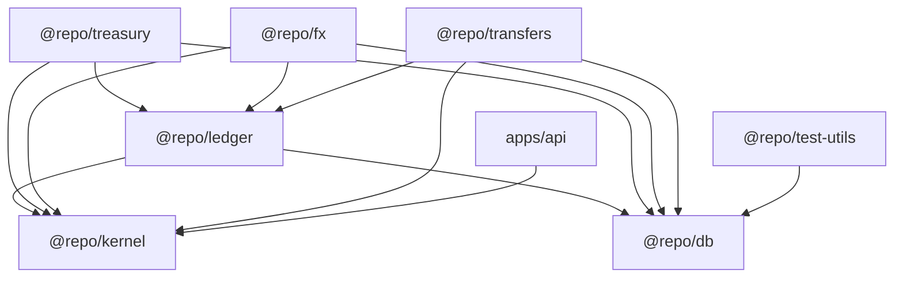
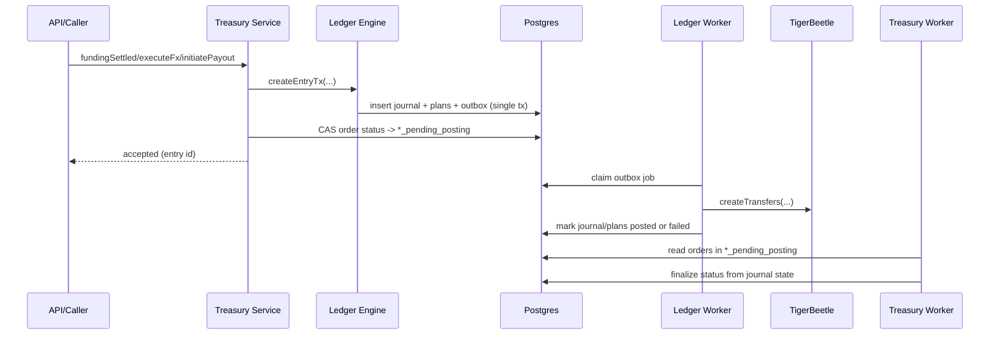

# Ledger Monorepo Architecture

Last updated: 2026-02-10

## Purpose

This repository implements a financial processing core with:

- Double-entry ledger journaling
- TigerBeetle posting pipeline
- Treasury payment lifecycle orchestration
- FX quote/rate services
- Internal maker/checker transfers

The architecture is package-first: domain behavior lives in `packages/*`; apps are thin entrypoints.

## Monorepo Layout

- `apps/api`: Hono/OpenAPI API app (composition root for services)
- `apps/web`: default Next.js frontend scaffold
- `packages/kernel`: shared primitives (errors, logging, canonicalization, currency, codes)
- `packages/db`: Drizzle schema and DB client
- `packages/ledger`: journal engine, TB plan generation, TB posting worker
- `packages/treasury`: payment order state machine and posting finalizer worker
- `packages/fx`: rates, quotes, quote consumption
- `packages/transfers`: internal transfer maker/checker service and posting worker
- `packages/test-utils`: shared fixture and DB mock helpers for tests
- `packages/ui`: shared React UI primitives
- `packages/eslint-config`: shared lint config
- `packages/typescript-config`: shared TS config package

## Package Dependency Graph

## Core Runtime Model

The financial core is split into two phases:

1. Synchronous business acceptance phase:
- Domain services (`treasury`, `transfers`) validate inputs and state.
- Ledger engine (`ledger.createEntryTx`) writes immutable journal intent.
- Transfer plans and outbox jobs are created transactionally.

2. Asynchronous posting phase:
- `ledger` worker claims outbox jobs, resolves TB accounts, executes transfers in TigerBeetle.
- Journal and TB plan statuses are finalized.
- Domain-specific workers (`treasury`, `transfers`) finalize business statuses when journal status becomes `posted` or `failed`.

This pattern decouples business APIs from external posting side effects while keeping exactly-once semantics through idempotency and deterministic IDs.

## Primary Data Flow

### 1) Ledger intent creation

`@repo/ledger` `createEntryTx`:

- Validates `CreateEntryInput` and transfer plan shapes
- Enforces contiguous chain blocks for linked TB semantics
- Computes deterministic `planFingerprint` from canonicalized transfer plan
- Inserts `journal_entries` with `(org_id, idempotency_key)` uniqueness
- Derives human-readable journal lines for `create` transfers
- Generates deterministic TB transfer IDs from `(orgId, entryId, idx, planKey)`
- Inserts `tb_transfer_plans`
- Enqueues outbox job (`kind='post_journal'`)

### 2) TigerBeetle posting

`@repo/ledger` worker:

- Claims outbox jobs via SQL leasing and retries
- Builds TB transfers from `tb_transfer_plans`
- Resolves account keys to TB account IDs using deterministic mapping
- Executes `createTransfers`
- Marks plans and journal as `posted` on success
- Exponential backoff for retryable failures
- Terminal failure path updates outbox, plan, and journal statuses

### 3) Domain state finalization

`@repo/treasury` and `@repo/transfers` workers:

- Poll domain rows in `*_pending_posting` states
- Read linked journal status
- Move domain status to final `posted/failed` family when journal finalizes

## Treasury Order Lifecycle

Defined `payment_orders.status` states:

- `quote`
- `funding_pending`
- `funding_settled_pending_posting`
- `funding_settled`
- `fx_executed_pending_posting`
- `fx_executed`
- `payout_initiated_pending_posting`
- `payout_initiated`
- `closed_pending_posting`
- `closed`
- `failed_pending_posting`
- `failed`

Transitions are service-driven and finalized by worker based on journal status.

## Internal Transfers Lifecycle

Defined `internal_transfers.status` states:

- `draft`
- `approved_pending_posting`
- `posted`
- `rejected`
- `failed`

Maker/checker behavior:

- `createDraft` creates draft transfer with idempotency per `(orgId, idempotencyKey)`
- `approve` creates ledger entry and CAS-transitions to pending posting
- `reject` CAS-transitions from draft to rejected
- `markFailed` supports operational failure handling from pending posting
- Worker finalizes posted/failed from journal status

## FX Lifecycle

FX subsystem currently provides:

- Policies (`fx_policies`): margin, fee, TTL
- Rates (`fx_rates`): direct/inverse/cross rate retrieval
- Quotes (`fx_quotes`): idempotent quote creation, expiration, mark-used semantics

Treasury `executeFx` currently uses quote reference as input for journaling keys; quote-binding enforcement should be considered part of further hardening.

## Storage Model

Primary tables by concern:

- Ledger intent/posting:
  - `journal_entries`
  - `journal_lines`
  - `tb_transfer_plans`
  - `outbox`
  - `ledger_accounts`
- Treasury/payment:
  - `payment_orders`
  - `settlements`
  - `organizations`
  - `customers`
  - `bank_accounts`
- FX:
  - `fx_policies`
  - `fx_rates`
  - `fx_quotes`
- Internal transfers:
  - `internal_transfers`

## Reliability and Control Patterns

- Deterministic IDs:
  - TB ledger ID from currency hash
  - TB account ID from `(orgId, key, tbLedger)` hash
  - TB transfer ID from `(orgId, journalEntryId, idx, planKey)` hash
- Idempotency:
  - Unique keys on journal entries, payment orders, internal transfers, fx quotes
- CAS transitions:
  - Service updates use status predicates to avoid lost updates
- Outbox + worker retries:
  - Lease-based claiming
  - Retry/backoff and terminal failure handling
- Self-healing account mapping:
  - Existing DB account mappings are re-attempted in TigerBeetle during resolution

## Current Gaps and Tradeoffs

Current architecture is strong for deterministic posting and retries but remains a work in progress for:

- End-to-end reconciliation workflows and exception handling surfaces
- Full quote-binding and quote-consumption integration in treasury execution paths
- Netting operations beyond account-level representation
- Consistent strict typing in transaction internals (many `tx: any`)

## Diagram: Payment + Posting

